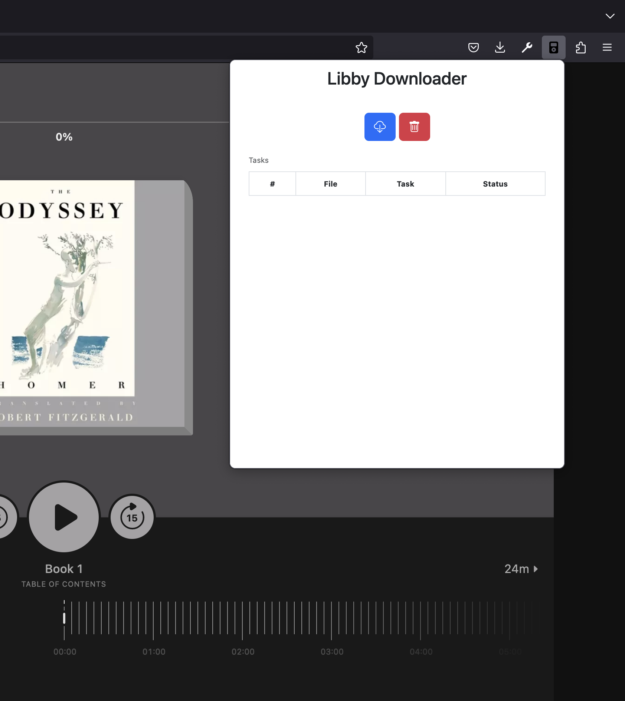
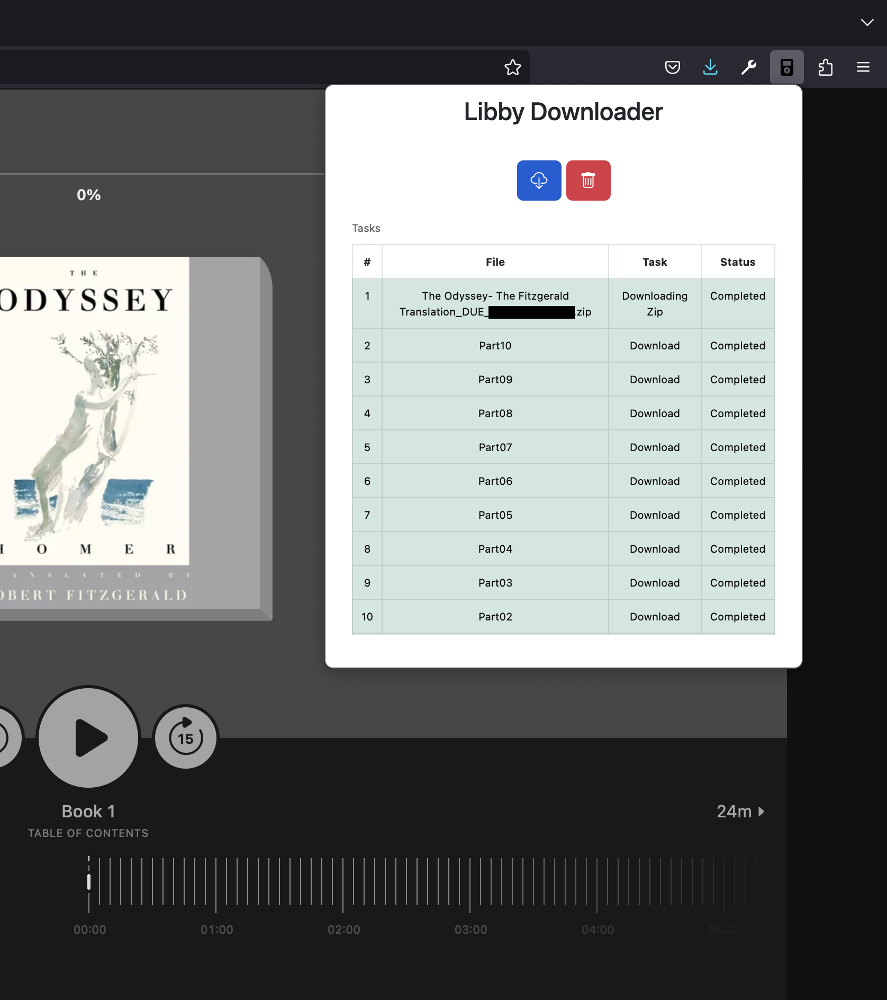
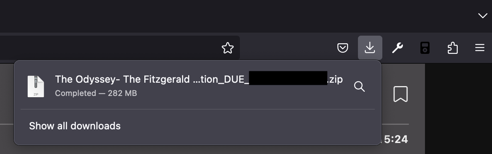

# Libby Downloader

<center></center>

> Libby Downloader is a Firefox extension that allows for download and transfer of audiobooks from the Libby website for transfer to devices that are now unsupported (e.g. the Sansa Clip).

## Installation

Install Libby Downloader from the [Firefox Extension Store](https://addons.mozilla.org/en-US/firefox/extensions/). **Note: Minimum supported Firefox version is 102 ESR**

## Disclaimer

Books downloaded by this tool are still due on their due date. This tool is **not** intended to help you "keep" your borrowed books. The due date can be found in the filename and MP3 tags.

## Use

Navigate to a borrowed audiobook on [Libby](https://libbyapp.com) and open the extension.



Click the download button to begin downloading your audiobook.



Once finished, there will be a zip file in your downloads folder containing the processed mp3.



## Technical Details

Like Overdrive, Libby hosts Audiobooks in multiple part files, and chapters can span multiple parts. The output zip file contains a single mp3 created by merging all the parts and a cue file with the chapter boundaries in relation to this merged file (instead of their individual part file as Libby stores them).

### MP3 Tags

The MP3 is created with the following ID3v2 tags

* `title`: Audiobook Title `<title>: <subtitle> (<series>)`
* `album`: Audiobook Title `<title>: <subtitle> (<series>)`
* `artist`: Comma separated list of authors
* `composer`: Comma separated list of narrators
* `image`: Cover from Libby
* `validUntil`: Due date
* `chapters`: Embedded chapter locations

### Chapters

If your device doesn't support embedded chapters via ID3v2 tags you can:

#### Split by Chapter

The mp3 can be split into a file per chapter by various tools which understand the accompanying cue file
or [yermak/AudioBookConverter](https://github.com/yermak/AudioBookConverter).

#### Convert to M4B

The MP3 can be converted into an M4B file by using a tool like FFmpeg or [yermak/AudioBookConverter](https://github.com/yermak/AudioBookConverter) which do understand embedded chapter information.

## Contributing

### Available Scripts

In the project directory, you can run the following scripts:

#### npm dev

**Development Mode**: This command runs the extension in development mode. It will launch a new browser instance with the extension loaded. The page will automatically reload whenever you make changes.

```bash
npm dev
```

#### npm start

**Production Preview**: This command runs the extension in production mode. It will launch a new browser instance with the extension loaded, simulating the environment and behavior of the extension as it will appear once published.

```bash
npm start
```

#### npm build

**Build for Production**: This command builds the extension for production. It optimizes and bundles the extension, preparing it for deployment to the target browser's store.

```bash
npm build
```

### Learn More About Extension.js

To learn more about creating cross-browser extensions with Extension.js, visit the [official documentation](https://extension.js.org).

## License

This project is licensed under the MIT License - see the [LICENSE](LICENSE) file for details.

## Acknowledgements

This project is not affiliated with, endorsed, or sponsored by OverDrive, Inc. or any of its affiliates. The Libby name, logo, and other trademarks are the property of their respective owners.

This project is a fork of [bookbonobo/libby-download-extension](https://github.com/bookbonobo/libby-download-extension). Credit for the original idea and implementation goes to the original author. This fork is an effort to modernize the extension and make it more maintainable.
